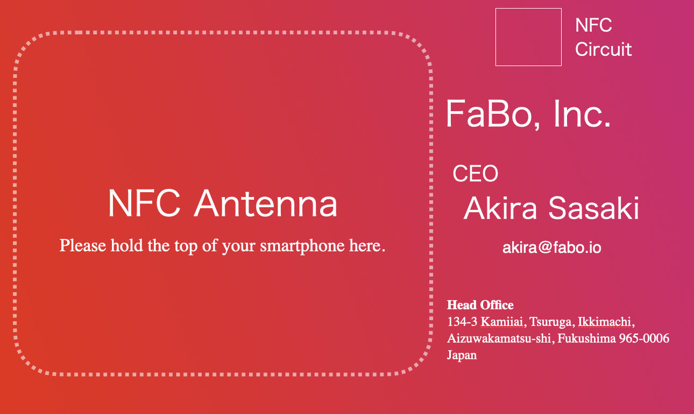

# KibanMeishiSkills

EasyEDAでNFC基板名刺を設計し、JLCPCBのMulticolor SilkscreenとPCBA向けのデータ準備から注文画面の入力・照合まで支援するCodex Skillです。ST25TN01K-AFH5を用いた名刺制作の知見を収録しています。

## 使い方

`kiban-meishi` フォルダを `~/.codex/skills/` に配置し、**基板名刺の表面に印刷したい画像をプロンプトと一緒に添付**し、Codexから次のように指定します。画像内の文字やレイアウトも印刷素材として扱います。

```text
$kiban-meishi 添付画像を基板名刺の表面にMulticolor Silkscreenで印刷してください。
ST25TN01K-AFH5、青0603 LED、100Ω抵抗の構成で、
厚さ0.6 mm・四隅R2・表面カラー印刷のNFC名刺を20枚設計し、発注データを準備し、JLCPCBで0.6 mm・Multicolor Silkscreen・20枚を入力して。
```

入口は [SKILL.md](kiban-meishi/SKILL.md)。ライブ操作にはEasyEDAと接続用API／ブラウザ操作環境、発注にはJLCPCBアカウントが必要です。ドキュメントの参照とCSV／ZIP検査スクリプトは単独でも利用できます。

## 添付画像のサンプル

今回使用した画像を、提供者の許可を得てサンプルとして掲載しています。[サンプル画像を開く](kiban-meishi/assets/sample-business-card.png)から保存し、上記プロンプトと一緒に添付できます。



自分の名刺を作る際は、氏名・連絡先等を自分の内容にした画像を添付してください。サンプルは表面の印刷素材であり、アンテナや部品の電気設計データではありません。画像の比率と基板寸法が異なる場合は、文字の歪みや欠けを確認して配置方法を決めます。

## 収録内容

- 最小構成の部品候補、入力素材、設計・検証に必要な道具
- RFアンテナとLED負荷、抵抗値の計算と実測の区別
- EasyEDAのネットリスト・属性・DRC・角丸外形の扱い
- カラーGerber、BOM、CPLとJLCPCBの照合・見積・引き継ぎ
- Python標準ライブラリだけで使える入稿データの形式検査

これは量産保証済みの回路・Gerber配布ではありません。本Skillは100Ω・独自アンテナの構成を対象とし、その実機評価結果は未収録です。決済画面や注文一覧への遷移から支払完了を推定していません。
